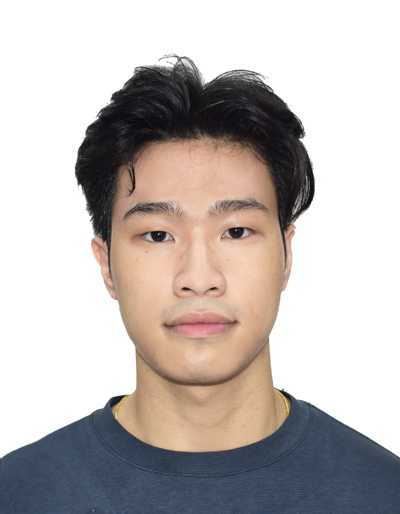

We are a team based in the [School of Computing, National University of Singapore](https://www.comp.nus.edu.sg).

You can reach us at the email `seer[at]comp.nus.edu.sg`

## Project team

### Javier Chua

[[homepage](http://www.comp.nus.edu.sg/~damithch)]
[[github](https://github.com/johndoe)]
[[portfolio](team/johndoe.md)]

* Role: Project Advisor

### Sean Ow

[[github](http://github.com/seanowww)]
[[portfolio](team/seanow.md)]

* Role: Developer
* Responsibilities: Functionality

### Divya Shah

[[github](http://github.com/divyashahhh)] [[portfolio](team/johndoe.md)]

* Role: Developer
* Responsibilities: Data Storage and UI

### Jason Lee

[[github](http://github.com/jasonleexc)]
[[portfolio](team/johndoe.md)]

* Role: Developer
* Responsibilities: Dev Ops

### Jeroy Lim

[[github](http://github.com/johndoe)]
[[portfolio](team/johndoe.md)]

* Role: Developer
* Responsibilities: UI
