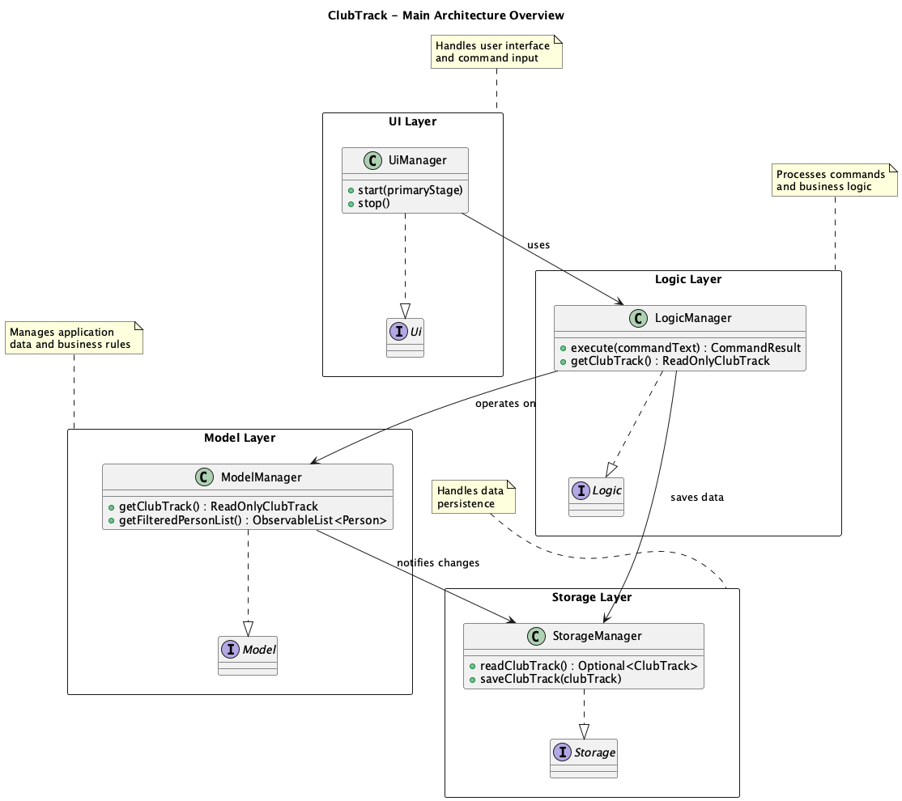
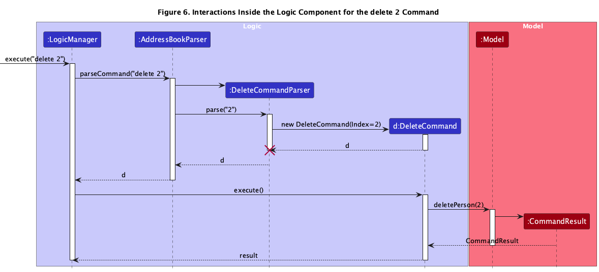
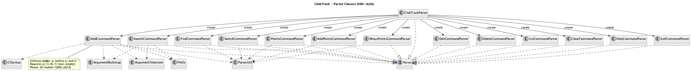

- [1. Introduction](#1-introduction)
- [2. Architecture](#2-architecture)
    - [2.1 Architectural Extension: Switchable Lists](#21-architectural-extension-switchable-lists)
- [3. UI Component](#3-ui-component)
- [4. Logic Component](#4-logic-component)
    - [4.1 Command Execution](#41-command-execution)
    - [4.2 Parser Class Diagram](#42-parser-class-diagram)
- [5. Model Component](#5-model-component)
    - [5.1 Person model](#51-person-model)
- [6. Storage Component](#6-storage-component)
- [7. Feature Implementation](#7-feature-implementation)
    - [7.1 `switch` feature](#71-switch-feature)
    - [7.2 `add` command (updated)](#72-add-command-updated)
    - [7.3 `find` vs `search`](#73-find-vs-search)
    - [7.4 Points features](#74-points-features)
- [8. Testing and Test Updates](#8-testing-and-test-updates)
- [9. Editing the data file](#9-editing-the-data-file)
- [10. User stories](#10-user-stories)
- [11. Use cases](#11-use-cases)
- [12. Non-Functional Requirements](#12-non-functional-requirements)
- [13. Glossary](#13-glossary)
- [14. Acknowledgements](#14-acknowledgements)
- [Appendix A – Instructions for Manual Testing](#appendix-a--instructions-for-manual-testing)
- [Appendix B – Effort](#appendix-b--effort)
- [Appendix C – Planned Enhancements](#appendix-c--planned-enhancements)

---

## 1. Introduction

This Developer Guide describes the architecture, design, and implementation details of **ClubTrack**, a desktop app for university club executives to manage members, track attendance, and award participation points quickly via a CLI-first workflow.

ClubTrack is adapted from **AddressBook Level 3 (AB3)** but extended with:

- compulsory `yearOfStudy` and `faculty` for members,
- attendance and points tracking,
- **switchable member lists** (each backed by its own JSON file),
- clearer separation between `find` (name-only, substring) and `search` (tag-prefix),
- updated UI (`PersonCard`) to display points and academic info,
- tighter validation on phone numbers (SG mobile: 8 digits, start with 8 or 9),
- updated tests to match the new constraints.

This guide assumes you are familiar with **Java 17**, **JavaFX**, **Gradle**, and the **AB3 architecture**.

---

## 2. Architecture

ClubTrack follows the classic AB3 4-layer architecture:

1. **UI** – shows data and accepts commands.
2. **Logic** – parses and executes commands.
3. **Model** – holds in-memory data and exposes filtered lists to UI.
4. **Storage** – reads/writes JSON files to disk.

The entry point is `MainApp`. On startup it:

1. loads config / user prefs;
2. initialises storage;
3. creates the model;
4. creates the logic; and
5. hands control to the UI.



### 2.1 Architectural Extension: Switchable Lists

In AB3, storage always pointed to **one** file (`addressbook.json`).

In ClubTrack, storage can point to **different files** depending on the **active list name**. The default file is:

```tex
data/ClubTrack.json
````

Whenever the user runs:

```tex
switch Training_2025_10_20
```

the app starts reading/writing:

```tex
data/Training_2025_10_20.json
```

All **mutating** commands (`add`, `edit`, `present`, `absent`, `clear`, `addpoints`, `minuspoints`, …) save to **the file of the currently active list**.

This keeps the architecture the same as AB3, but with an extra “current file” concept held by the Model/Storage.

---

## 3. UI Component

The UI layer is JavaFX-based and largely follows AB3.

**Main classes:**

* `UiManager` – entry point to the UI.
* `MainWindow` – top-level container; holds the command box, result display, status bar, and member list.
* `PersonListPanel` – shows the current list of members **for the active file**.
* `PersonCard` – shows:

    * name
    * **address**
    * **year of study** (e.g. `Y2`)
    * **faculty** (e.g. `School of Computing`)
    * phone
    * email
    * **Points: X**
    * tags


**Why this change?**

Because we made `y/` and `f/` compulsory at the parser level, the UI can safely render them without guessing defaults. Points are shown explicitly to help exco track participation.

When the model reloads a different list (due to `switch`), the observable list changes and the UI automatically refreshes.

---

## 4. Logic Component

The **Logic** component is responsible for:

1. receiving the raw command string from the UI,
2. parsing it using `AddressBookParser`,
3. creating the corresponding `Command`,
4. executing it on the `Model`,
5. saving through `Storage` if the command mutates data, and
6. returning a `CommandResult`.


### 4.1 Command Execution

The sequence diagram below illustrates the interactions inside the Logic component when executing a `delete` command. It shows how a user command string flows through the parsing layer to create a `Command` object, which is then executed to interact with the `Model` component.



**Flow:**
1. An external call to `LogicManager.execute("delete 2")` begins the process.
2. `LogicManager` delegates parsing to `ClubTrackParser.parseCommand("delete 2")`.
3. `ClubTrackParser` identifies the command word (`delete`) and creates the appropriate parser (`DeleteCommandParser`), which implements the `Parser` interface.
4. The `DeleteCommandParser` parses the argument (`"2"`) and instantiates a new `DeleteCommand` object with the parsed index.
5. The command object is returned to `LogicManager`.
6. `LogicManager` calls `execute()` on the `DeleteCommand`, which invokes `deletePerson(2)` on the `Model`.
7. The `Model` performs the deletion, constructs a `CommandResult` object to represent the outcome, and returns it to `LogicManager`.
8. `LogicManager` returns the `CommandResult` to the caller (e.g., the UI).

This interaction pattern is consistent across all commands — every command goes through the same **parse → create → execute → result** cycle.

**Key classes involved:**
- `LogicManager` — main orchestrator that executes user commands.
- `ClubTrackParser` — determines which parser to use based on the command word.
- `Parser` (interface) — defines the `parse(String args)` method.
- `DeleteCommandParser` — concrete parser that extracts the argument and constructs `DeleteCommand`.
- `Command` (abstract) — base class for all executable user commands.
- `CommandResult` — encapsulates the output of command execution.
- `Model` — the data layer that performs the actual operation (e.g., delete, add).

**Design intent:**  
This structure cleanly separates concerns between **command parsing**, **command execution**, and **data management**, allowing new commands to be added with minimal coupling.

---

### 4.2 Parser Class Diagram

The diagram below provides a detailed view of the **Parser layer**, showing how user input is transformed into executable `Command` objects.



**Description:**
- `ClubTrackParser` serves as the **entry point** for all command strings.  
  It reads the user input, identifies the command word, and delegates parsing to the corresponding command parser (represented collectively as `XYZCommandParser`).
- Each concrete command parser (e.g., `SearchCommandParser`, `SwitchCommandParser`) implements the `Parser` interface and follows the same structure:  
  tokenize input → extract arguments → create the corresponding `Command`.
- `XYZCommandParser` represents all other command parsers (`AddCommandParser`, `EditCommandParser`, etc.) in simplified form for clarity.
- `CliSyntax`, `Prefix`, `ArgumentTokenizer`, and `ArgumentMultimap` form the utility layer responsible for processing argument prefixes (e.g., `n/`, `p/`, `t/`) and mapping them to their values.
- `ParserUtil` provides static helper methods for validating and converting these argument values into model types (e.g., `Name`, `Tag`, `Phone`).

**Key relationships:**
- `ClubTrackParser` **creates** the appropriate parser (`XYZCommandParser`) based on the user input.
- Each parser **creates** a `Command` instance after parsing its arguments.
- `ParserUtil`, `ArgumentTokenizer`, and `ArgumentMultimap` are **used** across multiple parsers to handle argument processing.
- `CliSyntax` and `Prefix` define how argument prefixes are recognized and structured.

**Design intent:**  
This modular parser design ensures that adding new commands only requires:
1. Creating a new `*CommandParser` class implementing the `Parser` interface, and
2. Registering it in `ClubTrackParser`.

This maintains **consistency**, **extensibility**, and **low coupling** across all commands.

---

## 5. Model Component

The **Model** layer keeps the application state and provides observable lists to the UI.


**Main responsibilities:**

* hold the current `AddressBook` (for the active list),
* expose `FilteredList<Person>` for UI,
* remember the **active list name** (e.g. `ClubTrack`, `Training_2025_10_20`),
* hold user preferences.

### 5.1 Person model

We extended AB3’s `Person` to include club-specific and attendance fields:

```tex
Person
 ├─ name : Name
 ├─ phone : Phone           // 8 digits, start with 8 or 9
 ├─ email : Email
 ├─ address : Address       // shown on card
 ├─ yearOfStudy : int       // 1..5
 ├─ faculty : String        // non-empty
 ├─ tags : Set<Tag>
 ├─ isPresent : boolean     // for attendance
 └─ points : Points         // value object
```

We also changed **identity**:

* **Before (AB3):** name-based
* **Now:** **same person = same email OR same phone**

    * lets us store multiple people with the same name
    * it still guards against accidental duplicates using contact info

`Points` is implemented as a small value object to make it easy to reason about add/subtract operations.

---

## 6. Storage Component

The Storage layer reads/writes JSON using the usual AB3 JSON storage classes, but with an extra concept: **active list name = file name**.


**Behaviour:**

* On startup, we try to read:

  ```tex
  data/ClubTrack.json
  ```

  If it does not exist, we create it with a sample ClubTrack dataset.

* When the user runs:

  ```tex
  switch CCA_Showcase
  ```

  we from then on read/write:

  ```tex
  data/CCA_Showcase.json
  ```

* `clear` only clears the **currently loaded** address book, and then saves it back to **the same file**.

This design keeps lists isolated. Each event/training/day can have its own file, but the rest of the architecture is unchanged.

---

## 7. Feature Implementation

### 7.1 `switch` feature

**Goal:** let exco maintain multiple independent member/attendance lists (e.g. Week 1 training, production night, ad-hoc event) without mixing data.

**Command format:**

```tex
switch LIST_NAME
```

**Flow:**

1. `LogicManager` parses `LIST_NAME`.
2. `Model` is told to “activate” that list.
3. `Storage` tries to load `data/LIST_NAME.json`:

    * if present → load
    * if missing → create a new empty address book, save as `data/LIST_NAME.json`
4. UI refreshes because the model’s observable list changed.

**Activity diagram:**


**Design considerations:**

* We store the active list name in the model layer so that **all** mutating commands (add, edit, present, points, clear) can save to the correct file.
* We **reused** the same JSON structure from AB3 to minimise changes.
* This fits the CS2103T expectation that *clear should not unexpectedly wipe unrelated data.*

---

### 7.2 `add` command (updated)

**Old (AB3):** name, phone, email, **address** were compulsory; others optional.
**New (ClubTrack):** we keep **address** in the same position as AB3, then make **year of study** (`y/`) and **faculty** (`f/`) compulsory **after** address.

**New format (final):**

```tex
add n/NAME p/PHONE e/EMAIL a/ADDRESS y/YEAR_OF_STUDY f/FACULTY [t/TAG]...
```

**Validation:**

* `p/PHONE` → 8 digits, starts with 8 or 9
* `a/ADDRESS` → non-empty
* `y/` → integer 1–4
* `f/` → non-empty
* single-valued prefixes must not be repeated

**Why this order?**

* It stays close to AB3 (which markers/testers already know).
* We only **extended** the person with `y/` and `f/`, we did not reorder all existing prefixes.
* It keeps **User Guide** and **Developer Guide** consistent.

**Example:**

```tex
add n/John Doe p/91234567 e/johnd@example.com a/Blk 123, #02-01 y/2 f/School of Computing t/committee
```

---

### 7.3 `find` vs `search`

We deliberately split them to reduce PE bugs and to make behaviour easy to explain.

#### 7.3.1 `find`

* **Purpose:** quick lookup by **name only**
* **Behaviour:** case-insensitive **contains** on the *name* field
* **Does NOT** search tags, faculty, year, or address
* **Examples:**

  ```tex
  find john
  find alex david
  ```

  matches `John`, `Johnathan`, `Alex David`.

#### 7.3.2 `search`

* **Purpose:** structured filtering, especially **tag-based**
* **Behaviour:** tag **prefix** matching
* **Example:**

  ```tex
  search t/log
  ```

  matches people tagged `logistics`, `logiCore`, `log`, because the tag **starts with** `log`.

You may also supply a name component in the future, but for v1.5 the key is: **“find is for names; search is for tags.”**

---

### 7.4 Points features

We added a lightweight points system for participation:

* `addpoints INDEX pts/VALUE` – add `VALUE` to member’s points
* `minuspoints INDEX pts/VALUE` – subtract `VALUE`
* `points INDEX` – **show** member’s current points (does not edit)

This is model-only, so the UI just renders `Points: X` from the person.

---

## 8. Testing and Test Updates

Because we tightened phone validation **and** made `y/` + `f/` compulsory, several AB3 tests needed updating.

**What we changed:**

1. **Test constants**

    * `VALID_PHONE_AMY = "88888888"`
    * `VALID_PHONE_BOB = "99999999"`
    * Any other phone in test fixtures must be 8 digits starting with 8/9.

2. **Parser tests**

    * `AddCommandParserTest` must now include **both** `y/` and `f/` **and** keep the new prefix order: `a/` → `y/` → `f/`.
    * Duplicate-prefix tests must list `y/` and `f/` in the expected error where relevant.

3. **Storage-related tests**

    * In tests where we trigger an `add` to force a save (e.g. in `LogicManagerTest`), the input must now contain **all compulsory prefixes**:

      ```tex
      add n/Amy p/88888888 e/amy@example.com a/Blk 123 y/1 f/School of Computing
      ```

4. **Typical persons**

    * `TypicalPersons` → change phones to valid SG numbers.

This keeps test data aligned with the real rules users see in the UI/UG.

---

## 9. Editing the data file

ClubTrack stores data in:

```tex
[JAR location]/data/<listName>.json
```

* Default list:

  ```tex
  data/ClubTrack.json
  ```

* After `switch soccer` (or any other name):

  ```tex
  data/soccer.json
  ```

Advanced users may edit these JSON files manually.

> ⚠️ **Caution:** If the JSON is malformed or fields are missing, ClubTrack will start that list empty the next time it is loaded. Always back up your `data/` folder first.

---

\
## 10. User stories

Priorities: High (must have) – `* * *`, Medium (nice to have) – `* *`, Low (unlikely to have) – `*`

| Priority | As a …           | I want to …                            | So that I can …                           |
|----------|------------------|----------------------------------------|-------------------------------------------|
| `* * *`  | Club Exco Member | add a new member                       | keep track of the membership list         |
| `* * *`  | Club Exco Member | edit a member’s details                | keep contact information up to date       |
| `* * *`  | Club Exco Member | delete a current member                | keep the membership list up to date       |
| `* * *`  | Club Exco Member | list all members                       | see the complete membership at a glance   |
| `* * *`  | Club Exco Member | search for a member by name            | find them quickly without scrolling       |
| `* * *`  | Club Exco Member | search members by tag prefix           | filter according to specific criteria     |
| `* * *`  | Club Secretary   | mark a member as present               | keep track of their attendance            |
| `* * *`  | Club Secretary   | unmark a member as present             | correct attendance mistakes               |
| `* * *`  | Club Secretary   | view attendance list                   | verify attendance status                  |
| `* * *`  | Club Exco Member | tag a member                           | record their role or committee            |
| `* * *`  | Club Exco Member | remove a tag from a member             | keep tags accurate and up to date         |
| `* * *`  | Club Exco Member | switch to another member list          | manage attendance for different events    |
| `* * *`  | Club Exco Member | remove an existing list                | delete outdated event rosters             |
| `* * *`  | Club Exco Member | add points to a member                 | reward participation and contributions    |
| `* * *`  | Club Exco Member | deduct points from a member            | correct point assignment mistakes         |
| `* * *`  | Club Exco Member | view a member’s current points         | see their participation progress          |
| `* *`    | Club Exco Member | clear all members in the current list  | reset event attendance quickly            |
| `* *`    | Club Exco Member | access help information                | learn how to use the available commands   |
| `* *`    | Club Exco Member | exit the program                       | close the application safely              |
| `*`      | Club Secretary   | view attendance summary for a date     | check how many people showed up           |
| `*`      | Club Exco Member | list members sorted by attendance rate | see who participates most/least           |
| `*`      | Club Exco Member | generate a random selection of members | pick someone fairly                       |
| `*`      | Club Exco Member | export member data to a file           | share it with other committees/executives |

*Note: Some user stories above are for future versions and may not be in the current build.*

---

Here’s your **updated Use Cases section** rewritten to fully reflect ClubTrack’s current commands, features, and audience — following CS2103T format and tone. It’s copy-paste ready for your `.md` file ✅

---

## 11. Use cases

(For all use cases below, the **System** is `ClubTrack` and the **Actor** is the `user`, unless specified otherwise.)

---

### **UC01 – Add a member**

**MSS**

1. User issues the `add` command with valid prefixes, for example:

   ```tex
   add n/John Doe p/91234567 e/john@example.com a/Blk 123, #02-01 y/2 f/SOC t/committee
   ```
2. ClubTrack validates each field (e.g. phone format, year range, non-empty faculty/address).
3. ClubTrack adds the member to the **active list** and saves the list to disk.
4. ClubTrack displays a confirmation message and shows the new member in the UI.
   Use case ends.

**Extensions**

* 1a. Missing or invalid field (e.g. invalid phone/year/faculty)

    * 1a1. ClubTrack shows an error message. Use case ends.
* 3a. Duplicate member detected (same phone or email)

    * 3a1. ClubTrack rejects the command and shows a duplicate-member error. Use case ends.

---

### **UC02 – Edit a member**

**MSS**

1. User issues the `edit` command with the member’s index and fields to change, e.g.:

   ```tex
   edit 2 p/91234568 a/21 Kent Ridge y/3
   ```
2. ClubTrack validates the new input fields and locates the member by index.
3. ClubTrack updates the member’s details and saves the updated list.
4. ClubTrack displays a success message and the updated member details in the UI.
   Use case ends.

**Extensions**

* 2a. Invalid index

    * 2a1. ClubTrack shows an invalid index error. Use case ends.
* 1a. Attempt to edit to a duplicate member (same phone/email)

    * 1a1. ClubTrack rejects the edit and shows a duplicate-member error. Use case ends.

---

### **UC03 – Mark attendance for an event**

**MSS**

1. User switches to the relevant list for the event (e.g. `switch Training_2025_10_20`).
2. User issues the `present` command with a member’s index, e.g.:

   ```tex
   present 3
   ```
3. ClubTrack marks the member as present in that event list.
4. ClubTrack displays a success message and updates the attendance status in the UI.
   Use case ends.

**Extensions**

* 2a. Invalid index or member not found

    * 2a1. ClubTrack shows an error message. Use case ends.
* 3a. Member already marked present

    * 3a1. ClubTrack shows a warning and makes no change. Use case ends.

---

### **UC04 – Add points to a member**

**MSS**

1. User issues the `addpoints` command with a valid member index and points value, e.g.:

   ```tex
   addpoints 1 pts/5
   ```
2. ClubTrack validates that the points value is a positive integer within reasonable limits.
3. ClubTrack updates the member’s points in the active list and saves the file.
4. ClubTrack displays the new total points and a confirmation message.
   Use case ends.

**Extensions**

* 1a. Invalid index or points format

    * 1a1. ClubTrack shows an error message. Use case ends.

---

### **UC05 – Search for members by tag**

**MSS**

1. User issues the `search` command with one or more tag prefixes, e.g.:

   ```tex
   search t/exco t/dance
   ```
2. ClubTrack filters members whose tags begin with the given prefixes.
3. ClubTrack displays the filtered list of matching members.
   Use case ends.

**Extensions**

* 1a. No matches found

    * 1a1. ClubTrack shows a message indicating no members found. Use case ends.

---

### **UC06 – Switch to another member list**

**MSS**

1. User issues the `switch` command with the desired list name, e.g.:

   ```tex
   switch MatchDay_2025_11_05
   ```
2. ClubTrack checks if the list file exists in the `data/` directory.
3. If it exists, ClubTrack loads it; otherwise, a new empty list is created.
4. ClubTrack displays confirmation and updates the UI to show the new active list.
   Use case ends.

**Extensions**

* 2a. Invalid list name (e.g. contains restricted characters)

    * 2a1. ClubTrack rejects the command and shows an error message. Use case ends.

---

### **UC07 – Delete a member**

**MSS**

1. User issues the `delete` command with the member’s index, e.g.:

   ```tex
   delete 4
   ```
2. ClubTrack validates the index and removes the corresponding member from the active list.
3. ClubTrack saves the updated list and displays a confirmation message.
   Use case ends.

**Extensions**

* 1a. Invalid index

    * 1a1. ClubTrack shows an invalid index error. Use case ends.

---

### **UC08 – Clear current list**

**MSS**

1. User issues the `clear` command to remove all members from the current list.
2. ClubTrack prompts for confirmation (if applicable).
3. Upon confirmation, ClubTrack clears the list and saves an empty file.
4. ClubTrack displays a success message and an empty list in the UI.
   Use case ends.

**Extensions**

* 2a. User cancels confirmation

    * 2a1. ClubTrack aborts and no data is modified. Use case ends.

---

### **UC09 – View member points**

**MSS**

1. User issues the `points` command with a member’s index, e.g.:

   ```tex
   points 2
   ```
2. ClubTrack retrieves and displays the total points of the specified member.
   Use case ends.

**Extensions**

* 1a. Invalid index

    * 1a1. ClubTrack shows an error message. Use case ends.

---

### **UC10 – Exit the program**

**MSS**

1. User issues the `exit` command.
2. ClubTrack saves all data and closes the application.
   Use case ends.

---

## 12. Non-Functional Requirements

1. Should work on any **mainstream OS** with Java 17 or above installed.
2. Should be able to support **up to 500 members per list**, with common commands such as `add`, `edit`, or `find` completing within **2 seconds under normal conditions**.
3. A **typical user** with above-average typing speed should be able to accomplish most tasks faster using commands than using the mouse.
4. Should automatically save data after every mutating command.
5. Core functionality should work fully **offline**.
6. Should maintain data integrity when recording or modifying information.
7. Should run on university PCs and personal laptops without requiring administrative rights.
8. Command prefixes should follow a **consistent format** to reduce user confusion.

---

## 13. Glossary

* **Club Exco Member** – executive committee member responsible for club administration.
* **Attendance Record** – a log entry indicating whether a member was present at a specific event.
* **Mainstream OS** – Windows, macOS, Linux.
* **Member Tag** – a label assigned to members to categorise them (e.g. `treasurer`, `dance`, `freshie`).
* **CLI** – Command Line Interface.
* **Active list** – the currently selected member list; determines which JSON file is read/written.
* **Duty Roster** – schedule assigning tasks to members.
* **Normal conditions** – refers to running ClubTrack on a mainstream operating system (Windows 11, macOS 14, or Ubuntu 22.04) with Java 17 or above, on a typical university laptop (≥ 8 GB RAM, ≥ 2.5 GHz dual-core processor, SSD storage) while managing up to 500 members.
* **Typical user** – a club executive or secretary familiar with basic computer use and able to type at an average speed of around 60 words per minute.
* **Common operations** – frequently used commands such as `add`, `edit`, `delete`, `find`, `list`, and `switch`.

---

## 14. Acknowledgements

* Project structure, Gradle setup, JSON storage utilities, and some diagrams are **adapted from** the official **AddressBook Level 3 (AB3)** project by the CS2103T teaching team.
* Some command patterns (parser → command → command test) follow AB3’s recommended structure.
* Original AB3 documentation: credit to CS2103T teaching team.

---

## Appendix A – Instructions for Manual Testing

### A.1 Launch and shutdown

1. Ensure you have Java 17.
2. Run `java -jar ClubTrack.jar`.
3. Verify that a `data/ClubTrack.json` file is created (if it didn’t exist).
4. Close the window → app should exit cleanly.

### A.2 Adding a member

**Input:**

```tex
add n/Amy Bee p/88888888 e/amy@example.com a/Blk 123 y/2 f/School of Computing
```

**Expected:**

* A new card appears with:

    * name “Amy Bee”
    * address shown
    * `Y2 - School of Computing`
    * phone `88888888`
    * `Points: 0`

**Error case:**

```tex
add n/Bob p/123 e/bob@example.com a/Tampines y/2 f/SOC
```

Expected: error about phone constraints.

### A.3 Switching lists

1. Run:

   ```tex
   switch Training_2025_10_20
   ```

2. Expected:

    * status message says list switched / created
    * list view becomes empty (for a new list)

3. Add someone here:

   ```tex
   add n/John p/91234567 e/john@example.com a/UTown y/1 f/SoC
   ```

4. Switch back:

   ```tex
   switch default
   ```

   Expected: you see the original list.
   Switch again to `Training_2025_10_20` → John is still there.

### A.4 Searching

1. Add a person with tag `Logistics` and one with tag `LogiCore`.

2. Run:

   ```tex
   search t/log
   ```

   Expected: both appear (prefix match).

3. Run:

   ```tex
   find log
   ```

   Expected: **does not** return them unless “log” appears in their **name**.

### A.5 Clearing current lis

1. Switch to a test list:

   ```tex
   switch TestList
   add n/Test p/91234567 e/test@example.com a/Biz y/1 f/SoC
   clear
   ```

2. Expected: current list becomes empty; other lists are **not** affected.

---

## Appendix B – Effort

**Team size:** 5

1. **What was harder than AB3?**

    * Supporting **multiple JSON files** (one per list) without rewriting AB3’s storage.
    * Making `y/` and `f/` compulsory → cascaded into parser tests, typical persons, and logic tests.
    * Tightening phone validation → broke a lot of upstream AB3 test data.
2. **What we reused:**

    * AB3 command–parser–storage structure
    * AB3 diagram style and sectioning
    * AB3 test patterns
3. **What we added:**

    * `SwitchCommand` + model/state to remember active list name
    * UI changes to display year/faculty/points
    * Tag-prefix search

---

## Appendix C – Planned Enhancements

**Team size:** 5

1. **List existing lists**
   Since we now create JSON files on demand, users should be able to run something like `lists` to see available roster files.

2. **Per-event attendance history**
   Currently attendance is a simple boolean. We plan to support per-session logs (date → present/absent).

3. **Role-based tags**
   Some tags are “roles” (President, Secretary). We can display them differently in the UI.

4. **Import from CSV**
   Many clubs keep members in Google Sheets. A CSV import would reduce data entry.

5. **Support for non-Singapore phone numbers**
   Currently only 8-digit local numbers (starting with 8 or 9) are allowed. We plan to extend validation to include international formats (e.g., +60, +65, +91).

6. **Allow `/` in member names**
   Certain legal names include slashes (e.g., “S/O John Doe”). We will enhance `Name` validation to support these characters safely.

7. **Input validation for duplicate faculty fields**
   Editing a member with multiple `f/` prefixes silently keeps the latest. We plan to detect duplicates and show a proper error message.

8. **Input validation for duplicate year fields**
   Similar to faculty, multiple `y/` prefixes during edit or add should trigger an error instead of overwriting the last value.

9. **Strict date validation for invalid calendar dates**
   Currently, invalid dates like 31/11/2025 are silently adjusted to the nearest valid date (30/11/2025) due to Java’s lenient date parsing. We plan to enable strict validation using ResolverStyle.STRICT so that impossible dates trigger a clear error message instead of being auto-corrected.

10. **Prevent directory traversal in list names**
    Lists with ../ in their names can delete files outside the app folder. Future versions will block such inputs to prevent unauthorized file access.