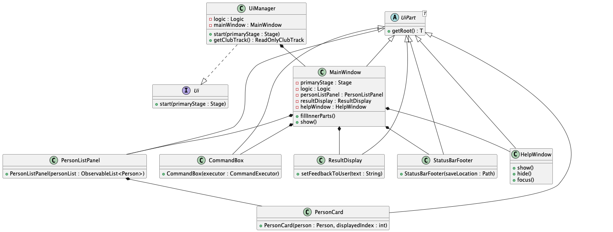
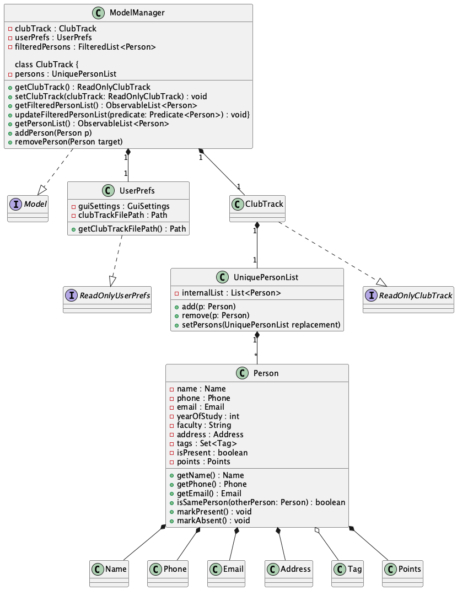
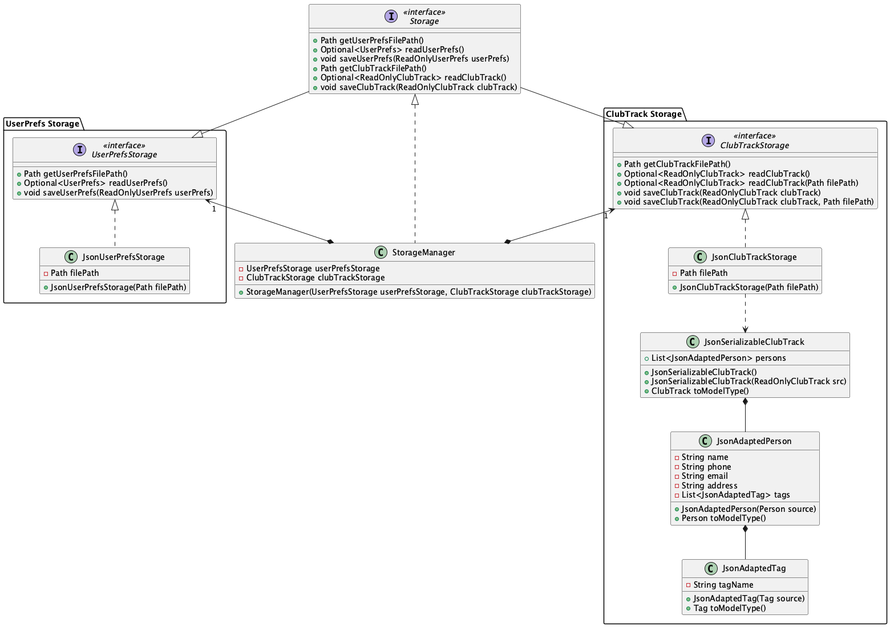
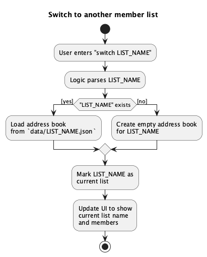

# Developer Guide

- [1. Introduction](#1-introduction)
- [2. Architecture](#2-architecture)
  - [2.1 Architectural Extension: Switchable Lists](#21-architectural-extension-switchable-lists)
- [3. UI Component](#3-ui-component)
- [4. Logic Component](#4-logic-component)
- [5. Model Component](#5-model-component)
  - [5.1 Person model](#51-person-model)
- [6. Storage Component](#6-storage-component)
- [7. Feature Implementation](#7-feature-implementation)
  - [7.1 `switch` feature](#71-switch-feature)
  - [7.2 `add` command (updated)](#72-add-command-updated)
  - [7.3 `find` vs `search`](#73-find-vs-search)
  - [7.4 Points features](#74-points-features)
- [8. Testing and Test Updates](#8-testing-and-test-updates)
- [9. Editing the data file](#9-editing-the-data-file)
- [10. User stories](#10-user-stories)
- [11. Use cases](#11-use-cases)
- [12. Non-Functional Requirements](#12-non-functional-requirements)
- [13. Glossary](#13-glossary)
- [14. Acknowledgements](#14-acknowledgements)
- [Appendix A – Instructions for Manual Testing](#appendix-a--instructions-for-manual-testing)
- [Appendix B – Effort](#appendix-b--effort)
- [Appendix C – Planned Enhancements](#appendix-c--planned-enhancements)

---

## 1. Introduction

This Developer Guide describes the architecture, design, and implementation details of **ClubTrack**, a desktop app for university club executives to manage members, track attendance, and award participation points quickly via a CLI-first workflow.

ClubTrack is adapted from **AddressBook Level 3 (AB3)** but extended with:

- compulsory `yearOfStudy` and `faculty` for members,
- attendance and points tracking,
- **switchable member lists** (each backed by its own JSON file),
- clearer separation between `find` (name-only, substring) and `search` (tag-prefix),
- updated UI (`PersonCard`) to display points and academic info,
- tighter validation on phone numbers (SG mobile: 8 digits, start with 8 or 9),
- updated tests to match the new constraints.

This guide assumes you are familiar with **Java 17**, **JavaFX**, **Gradle**, and the **AB3 architecture**.

---

## 2. Architecture

ClubTrack follows the classic AB3 4-layer architecture:

1. **UI** – shows data and accepts commands.
2. **Logic** – parses and executes commands.
3. **Model** – holds in-memory data and exposes filtered lists to UI.
4. **Storage** – reads/writes JSON files to disk.

The entry point is `MainApp`. On startup it:

1. loads config / user prefs;
2. initialises storage;
3. creates the model;
4. creates the logic; and
5. hands control to the UI.


### 2.1 Architectural Extension: Switchable Lists

In AB3, storage always pointed to **one** file (`addressbook.json`).

In ClubTrack, storage can point to **different files** depending on the **active list name**. The default file is:

```text
data/default.json
````

Whenever the user runs:

```text
switch Training_2025_10_20
```

the app starts reading/writing:

```text
data/Training_2025_10_20.json
```

All **mutating** commands (`add`, `edit`, `present`, `absent`, `clear`, `addpoints`, `minuspoints`, …) save to **the file of the currently active list**.

This keeps the architecture the same as AB3, but with an extra “current file” concept held by the Model/Storage.

---

## 3. UI Component

The UI layer is JavaFX-based and largely follows AB3.

**Main classes:**

* `UiManager` – entry point to the UI.
* `MainWindow` – top-level container; holds the command box, result display, status bar, and member list.
* `PersonListPanel` – shows the current list of members **for the active file**.
* `PersonCard` – shows:

    * name
    * **address**
    * **year of study** (e.g. `Y2`)
    * **faculty** (e.g. `School of Computing`)
    * phone
    * email
    * **Points: X**
    * tags



**Why this change?**

Because we made `y/` and `f/` compulsory at the parser level, the UI can safely render them without guessing defaults. Points are shown explicitly to help exco track participation.

When the model reloads a different list (due to `switch`), the observable list changes and the UI automatically refreshes.

---

## 4. Logic Component

The **Logic** component is responsible for:

1. receiving the raw command string from the UI,
2. parsing it using `AddressBookParser`,
3. creating the corresponding `Command`,
4. executing it on the `Model`,
5. saving through `Storage` if the command mutates data, and
6. returning a `CommandResult`.


**Key classes:**

* `Logic` (interface)
* `LogicManager` (concrete)
* `AddressBookParser`
* `Command` (abstract)
* Concrete commands:

    * `AddCommand`
    * `EditCommand`
    * `PresentCommand`, `AbsentCommand`, `AttendanceCommand`
    * `FindCommand` (**now: name-only, substring**)
    * `SearchCommand` (**now: tag-prefix filtering**)
    * `SwitchCommand` (**new**)
    * `PointsCommand`, `AddPointsCommand`, `MinusPointsCommand`
    * `ClearCommand` (clears **current** list only)

**Important change:**
After **every** successful mutating command, `LogicManager` asks `Storage` to save **to the JSON file of the current active list name**. This is the main place where the new “multiple lists” idea shows up in Logic.

---

## 5. Model Component

The **Model** layer keeps application state and provides observable lists to the UI.



**Main responsibilities:**

* hold the current `AddressBook` (for the active list),
* expose `FilteredList<Person>` for UI,
* remember the **active list name** (e.g. `default`, `Training_2025_10_20`),
* hold user preferences.

### 5.1 Person model

We extended AB3’s `Person` to include club-specific and attendance fields:

```text
Person
 ├─ name : Name
 ├─ phone : Phone           // 8 digits, start with 8 or 9
 ├─ email : Email
 ├─ address : Address       // shown on card
 ├─ yearOfStudy : int       // 1..4
 ├─ faculty : String        // non-empty
 ├─ tags : Set<Tag>
 ├─ isPresent : boolean     // for attendance
 └─ points : Points         // value object
```

We also changed **identity**:

* **Before (AB3):** name-based
* **Now:** **same person = same email OR same phone**

    * lets us store multiple people with the same name
    * still guards against accidental duplicates using contact info

`Points` is implemented as a small value object to make it easy to reason about add/subtract operations.

---

## 6. Storage Component

The Storage layer reads/writes JSON using the usual AB3 JSON storage classes, but with an extra concept: **active list name = file name**.



**Behaviour:**

* On startup, we try to read:

  ```text
  data/default.json
  ```

  If it does not exist, we create it with a sample ClubTrack dataset.

* When user runs:

  ```text
  switch CCA_Showcase
  ```

  we from then on read/write:

  ```text
  data/CCA_Showcase.json
  ```

* `clear` only clears the **currently loaded** address book, and then saves it back to **the same file**.

This design keeps lists isolated. Each event/training/day can have its own file, but the rest of the architecture is unchanged.

---

## 7. Feature Implementation

### 7.1 `switch` feature

**Goal:** let exco maintain multiple independent member/attendance lists (e.g. Week 1 training, production night, ad-hoc event) without mixing data.

**Command format:**

```text
switch LIST_NAME
```

**Flow:**

1. `LogicManager` parses `LIST_NAME`.
2. `Model` is told to “activate” that list.
3. `Storage` tries to load `data/LIST_NAME.json`:

    * if present → load
    * if missing → create new empty address book, save as `data/LIST_NAME.json`
4. UI refreshes because the model’s observable list changed.

**Activity diagram:**



**Design considerations:**

* We store the active list name in the model layer, so that **all** mutating commands (add, edit, present, points, clear) can save to the correct file.
* We **reused** the same JSON structure from AB3 to minimise changes.
* This fits the CS2103T expectation that *clear should not unexpectedly wipe unrelated data.*

---

### 7.2 `add` command (updated)

**Old (AB3):** name, phone, email, **address** were compulsory; others optional.
**New (ClubTrack):** we keep **address** in the same position as AB3, then make **year of study** (`y/`) and **faculty** (`f/`) compulsory **after** address.

**New format (final):**

```text
add n/NAME p/PHONE e/EMAIL a/ADDRESS y/YEAR_OF_STUDY f/FACULTY [t/TAG]...
```

**Validation:**

* `p/PHONE` → 8 digits, starts with 8 or 9
* `a/ADDRESS` → non-empty
* `y/` → integer 1–4
* `f/` → non-empty
* single-valued prefixes must not be repeated

**Why this order?**

* It stays close to AB3 (which markers/testers already know).
* We only **extended** the person with `y/` and `f/`, we did not reorder all existing prefixes.
* It keeps **User Guide** and **Developer Guide** consistent.

**Example:**

```text
add n/John Doe p/91234567 e/johnd@example.com a/Blk 123, #02-01 y/2 f/School of Computing t/committee
```

---

### 7.3 `find` vs `search`

We deliberately split them to reduce PE bugs and to make behaviour easy to explain.

#### 7.3.1 `find`

* **Purpose:** quick lookup by **name only**
* **Behaviour:** case-insensitive **contains** on the *name* field
* **Does NOT** search tags, faculty, year, or address
* **Examples:**

  ```text
  find john
  find alex david
  ```

  matches `John`, `Johnathan`, `Alex David`.

#### 7.3.2 `search`

* **Purpose:** structured filtering, especially **tag-based**
* **Behaviour:** tag **prefix** matching
* **Example:**

  ```text
  search t/log
  ```

  matches people tagged `logistics`, `logiCore`, `log`, because the tag **starts with** `log`.

You may also supply a name component in the future, but for v1.5 the key is: **“find is for names; search is for tags.”**

---

### 7.4 Points features

We added a lightweight points system for participation:

* `addpoints INDEX pts/VALUE` – add `VALUE` to member’s points
* `minuspoints INDEX pts/VALUE` – subtract `VALUE`
* `points INDEX` – **show** member’s current points (does not edit)

This is model-only, so the UI just renders `Points: X` from the person.

---

## 8. Testing and Test Updates

Because we tightened phone validation **and** made `y/` + `f/` compulsory, several AB3 tests needed updating.

**What we changed:**

1. **Test constants**

    * `VALID_PHONE_AMY = "88888888"`
    * `VALID_PHONE_BOB = "99999999"`
    * Any other phone in test fixtures must be 8 digits starting with 8/9.

2. **Parser tests**

    * `AddCommandParserTest` must now include **both** `y/` and `f/` **and** keep the new prefix order: `a/` → `y/` → `f/`.
    * Duplicate-prefix tests must list `y/` and `f/` in the expected error where relevant.

3. **Storage-related tests**

    * In tests where we trigger an `add` to force a save (e.g. in `LogicManagerTest`), the input must now contain **all compulsory prefixes**:

      ```text
      add n/Amy p/88888888 e/amy@example.com a/Blk 123 y/1 f/School of Computing
      ```

4. **Typical persons**

    * `TypicalPersons` → change phones to valid SG numbers.

This keeps test data aligned with the real rules users see in the UI/UG.

---

## 9. Editing the data file

ClubTrack stores data in:

```text
[JAR location]/data/<listName>.json
```

* Default list:

  ```text
  data/default.json
  ```

* After `switch clubtrack` (or any other name):

  ```text
  data/clubtrack.json
  ```

Advanced users may edit these JSON files manually.

> ⚠️ **Caution:** If the JSON is malformed or fields are missing, ClubTrack will start that list empty the next time it is loaded. Always back up your `data/` folder first.

---

## 10. User stories

Priorities: High (must have) – `* * *`, Medium (nice to have) – `* *`, Low (unlikely to have) – `*`

| Priority | As a …           | I want to …                                 | So that I can…                        |
| -------- | ---------------- | ------------------------------------------- | ------------------------------------- |
| `* * *`  | Club Exco Member | add a new member                            | keep track of the membership list     |
| `* * *`  | Club Secretary   | mark a member as present                    | keep track of their attendance        |
| `* * *`  | Club Exco Member | delete a current member                     | keep the membership list up to date   |
| `* * *`  | Club Exco Member | list all members                            | keep track of the total membership    |
| `* * *`  | Club Exco Member | search for a member by name                 | find them quickly without scrolling   |
| `* *`    | Club Secretary   | unmark a member as present                  | correct attendance mistakes           |
| `* *`    | Club Exco Member | tag a member                                | remember extra info (role, committee) |
| `* *`    | Club Exco Member | check if a member is present                | verify attendance status              |
| `* *`    | Club Exco Member | search members by tags                      | filter according to specific criteria |
| `* *`    | Club Exco Member | edit a member's details                     | keep contact information up to date   |
| `* *`    | Club Treasurer   | record membership fee payments              | track who has paid                    |
| `* *`    | Club Treasurer   | list members who haven't paid fees          | remind them to pay                    |
| `* *`    | Club Secretary   | view a member's attendance history          | track participation across events     |
| `*`      | Club Exco Member | export member data to a file                | share it with other parties           |
| `*`      | Club Exco Member | undo my last action                         | fix mistakes quickly                  |
| `*`      | Club Exco Member | count the total number of members           | report club size to the university    |
| `*`      | Club Secretary   | list members sorted by attendance rate      | see who participates most/least       |
| `*`      | Club Secretary   | list attendance summary for a specific date | check how many people showed up       |
| `*`      | Club Exco Member | generate a random selection of members      | pick someone fairly                   |
| `*`      | Club Treasurer   | record an expense                           | keep track of spending                |
| `*`      | Club Treasurer   | show all expenses                           | keep track of spending patterns       |

*Note: Some user stories above are for future versions and may not be in the current build.*

---

## 11. Use cases

(For all use cases below, the **System** is `ClubTrack` and the **Actor** is the `user`, unless specified otherwise.)

### UC01 – Tag a member with a role

**MSS**

1. User requests to find a specific member by name.
2. ClubTrack shows the member’s details.
3. User requests to tag the member with a specific role (e.g. `treasurer`).
4. ClubTrack adds the tag to the member and displays confirmation.
   Use case ends.

**Extensions**

* 1a. Member name is not found

    * 1a1. ClubTrack shows an error message.
      Use case ends.
* 3a. Tag format is invalid

    * 3a1. ClubTrack shows an error message with proper format.
      Use case resumes at step 3.

### UC02 – Mark attendance and track payment status

**MSS**

1. User requests to mark a member as present.
2. ClubTrack updates the member’s attendance record.
3. User requests to check if the same member has paid membership fees.
4. ClubTrack displays the member’s payment status.
5. If unpaid, user records the fee payment.
6. ClubTrack updates the member’s payment status.
   Use case ends.

**Extensions**

* 1a. Member not found → show error → use case ends.
* 3a. Member already paid → show current status → resume at step 6.

### UC03 – Generate attendance report for event planning

**MSS**

1. User requests to view attendance summary for a specific date.
2. ClubTrack displays the list of members who attended on that date.
3. User requests to see members sorted by attendance rate.
4. ClubTrack displays members ranked by attendance frequency.
5. User selects high-attendance members for important roles.
   Use case ends.

**Extensions**

* 1a. No attendance records → show “no records” → use case ends.
* 3a. Insufficient data → show partial data with a note → continue at step 5.

---

## 12. Non-Functional Requirements

1. **Performance**: Should work on any mainstream OS with Java 17 or above.
2. **Scalability**: Should handle up to 200 members per list without noticeable sluggishness.
3. **Usability**: A club exco member with above-average typing speed should be able to accomplish common tasks faster than using spreadsheets.
4. **Reliability**: Should maintain data integrity when recording attendance and payment information.
5. **Portability**: Should run on university PCs and personal laptops without admin rights.
6. **Response time**: Common ops (search, add, present) should complete within 2 seconds.
7. **Data persistence**: Should automatically save after every mutating command.
8. **Offline**: Core functionality should work without internet.
9. **Consistency**: CLI commands should follow consistent prefix style to reduce user confusion.

---

## 13. Glossary

* **Club Exco Member** – executive committee member responsible for club administration.
* **Attendance Record** – a log entry indicating whether a member was present at a specific event.
* **Mainstream OS** – Windows, macOS, Linux.
* **Member Tag** – a label assigned to members to categorise them (e.g. `treasurer`, `dance`, `freshie`).
* **Payment Status** – whether a member has paid required fees.
* **CLI** – Command Line Interface.
* **Active list** – the currently selected member list; determines which JSON file is read/written.
* **Duty Roster** – schedule assigning tasks to members.
* **Financial Record** – transaction logs including fees, expenses, etc.

---

## 14. Acknowledgements

* Project structure, Gradle setup, JSON storage utilities, and some diagrams are **adapted from** the official **AddressBook Level 3 (AB3)** project by the CS2103T teaching team.
* Some command patterns (parser → command → command test) follow AB3’s recommended structure.
* Original AB3 documentation: credit to CS2103T teaching team.

---

## Appendix A – Instructions for Manual Testing

### A.1 Launch and shutdown

1. Ensure you have Java 17.
2. Run `java -jar ClubTrack.jar`.
3. Verify that a `data/default.json` file is created (if it didn’t exist).
4. Close the window → app should exit cleanly.

### A.2 Adding a member

**Input:**

```text
add n/Amy Bee p/88888888 e/amy@example.com a/Blk 123 y/2 f/School of Computing
```

**Expected:**

* A new card appears with:

    * name “Amy Bee”
    * address shown
    * `Y2 - School of Computing`
    * phone `88888888`
    * `Points: 0`

**Error case:**

```text
add n/Bob p/123 e/bob@example.com a/Tampines y/2 f/SOC
```

Expected: error about phone constraints.

### A.3 Switching lists

1. Run:

   ```text
   switch Training_2025_10_20
   ```

2. Expected:

    * status message says list switched / created
    * list view becomes empty (for a new list)

3. Add someone here:

   ```text
   add n/John p/91234567 e/john@example.com a/UTown y/1 f/SoC
   ```

4. Switch back:

   ```text
   switch default
   ```

   Expected: you see the original list.
   Switch again to `Training_2025_10_20` → John is still there.

### A.4 Searching

1. Add a person with tag `Logistics` and one with tag `LogiCore`.

2. Run:

   ```text
   search t/log
   ```

   Expected: both appear (prefix match).

3. Run:

   ```text
   find log
   ```

   Expected: **does not** return them unless “log” appears in their **name**.

### A.5 Clearing current list

1. Switch to a test list:

   ```text
   switch TestList
   add n/Test p/91234567 e/test@example.com a/Biz y/1 f/SoC
   clear
   ```

2. Expected: current list becomes empty; other lists are **not** affected.

---

## Appendix B – Effort

**Team size:** 5

1. **What was harder than AB3?**

    * Supporting **multiple JSON files** (one per list) without rewriting AB3’s storage.
    * Making `y/` and `f/` compulsory → cascaded into parser tests, typical persons, and logic tests.
    * Tightening phone validation → broke a lot of upstream AB3 test data.
2. **What we reused:**

    * AB3 command–parser–storage structure
    * AB3 diagram style and sectioning
    * AB3 test patterns
3. **What we added:**

    * `SwitchCommand` + model/state to remember active list name
    * UI changes to display year/faculty/points
    * Tag-prefix search

---

## Appendix C – Planned Enhancements

**Team size:** 5

1. **List existing lists**
   Since we now create JSON files on demand, users should be able to run something like `lists` to see available roster files.

2. **Per-event attendance history**
   Currently attendance is a simple boolean. We plan to support per-session logs (date → present/absent).

3. **Role-based tags**
   Some tags are “roles” (President, Secretary). We can display them differently in the UI.

4. **Import from CSV**
   Many clubs keep members in Google Sheets. A CSV import would reduce data entry.
