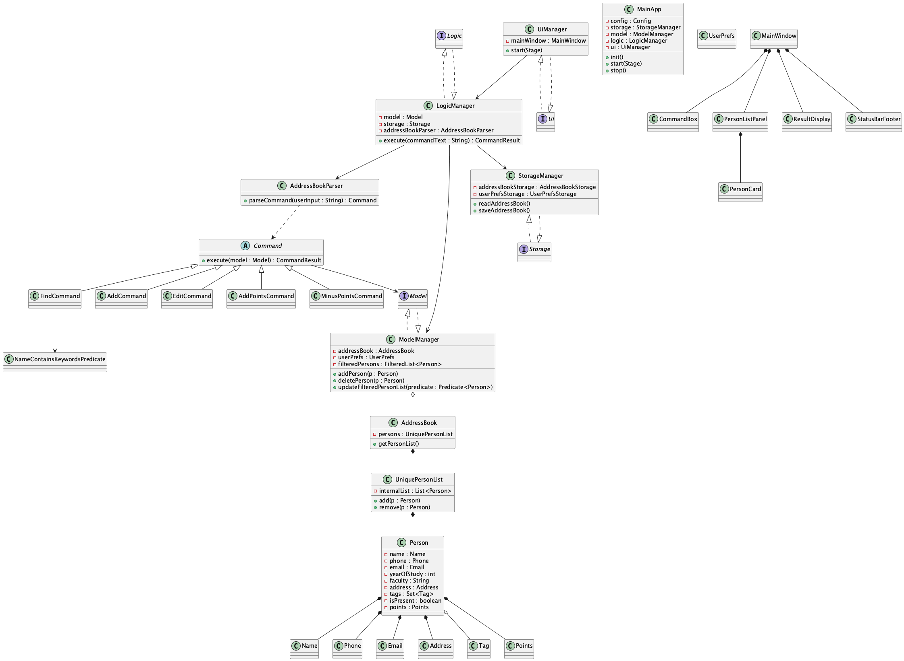

### Product scope

**Target user profile**:

* University student club executive committee (exco) members who are responsible for managing member information, attendance tracking, and duty rosters
* Usually busy during the semester and need to update records quickly
* Can type fast and prefer typing to mouse interactions
* Prefer desktop apps over web-based or mobile alternatives
* Is reasonably comfortable using CLI apps
* Has a need to manage club membership data, attendance records, financial tracking, and member duties

**Value proposition**: Manage club members, mark attendance, assign tags, track finances, and manage duty rosters more efficiently than traditional spreadsheet-based solutions through a fast CLI interface[1]

### User stories

Priorities: High (must have) - `* * *`, Medium (nice to have) - `* *`, Low (unlikely to have) - `*`

| Priority | As a …​ | I want to …​ | So that I can…​ |
|----------|---------|--------------|-----------------|
| `* * *` | Club Exco Member | add a new member | keep track of the membership list |
| `* * *` | Club Secretary | mark a member as present | keep track of their attendance |
| `* * *` | Club Exco Member | delete a current member | keep the membership list up to date |
| `* * *` | Club Exco Member | list all members | keep track of the total membership |
| `* * *` | Club Exco Member | search for a member by name | find them quickly without scrolling through the full list |
| `* *` | Club Secretary | unmark a member as present | correct attendance mistakes |
| `* *` | Club Exco Member | tag a member | remember additional information about a member (e.g., role, committee) |
| `* *` | Club Exco Member | check if a member is present | verify attendance status |
| `* *` | Club Exco Member | search members by tags | filter according to specific criteria |
| `* *` | Club Exco Member | edit a member's details | keep contact information up to date |
| `* *` | Club Treasurer | record membership fee payments | track who has made required payments |
| `* *` | Club Treasurer | list members who haven't paid fees | remind them to make payment |
| `* *` | Club Secretary | view a member's attendance history | track participation across events |
| `*` | Club Exco Member | export member data to a file | share it with other parties |
| `*` | Club Exco Member | undo my last action | fix mistakes quickly |
| `*` | Club Exco Member | count the total number of members | report club size to the university |
| `*` | Club Secretary | list members sorted by attendance rate | see who participates most or least |
| `*` | Club Secretary | list attendance summary for a specific date | check how many people showed up on that day |
| `*` | Club Exco Member | generate a random selection of members | pick someone fairly for games, questions, or duties |
| `*` | Club Treasurer | record an expense | keep track of money spent on events or materials |
| `*` | Club Treasurer | show all expenses | keep track of spending patterns |

*Note: Some user stories listed above are considered for future versions but may not be included in the current product iteration.*

### Use cases

(For all use cases below, the **System** is the `ClubTrack` and the **Actor** is the `user`, unless specified otherwise)

**Use case: UC01 - Tag a member with a role**

**MSS**

1. User requests to find a specific member by name
2. ClubTrack shows the member's details
3. User requests to tag the member with a specific role (e.g., "treasurer")
4. ClubTrack adds the tag to the member and displays confirmation

Use case ends.

**Extensions**

* 1a. The member name is not found.
    * 1a1. ClubTrack shows an error message.

  Use case ends.

* 3a. The tag format is invalid.
    * 3a1. ClubTrack shows an error message with proper format.

  Use case resumes at step 3.

**Use case: UC02 - Mark attendance and track payment status**

**MSS**

1. User requests to mark a member as present for today's meeting
2. ClubTrack updates the member's attendance record
3. User requests to check if the same member has paid membership fees
4. ClubTrack displays the member's payment status
5. If unpaid, user records the fee payment
6. ClubTrack updates the member's payment status

Use case ends.

**Extensions**

* 1a. The member is not found.
    * 1a1. ClubTrack shows an error message.

  Use case ends.

* 3a. The member's payment status is already marked as paid.
    * 3a1. ClubTrack displays current payment status.

  Use case resumes at step 6.

**Use case: UC03 - Generate attendance report for event planning**

**MSS**

1. User requests to view attendance summary for a specific date
2. ClubTrack displays the list of members who attended on that date
3. User requests to see members sorted by attendance rate
4. ClubTrack displays members ranked by their attendance frequency
5. User selects high-attendance members for important committee roles

Use case ends.

**Extensions**

* 1a. No attendance records exist for the specified date.
    * 1a1. ClubTrack shows a message indicating no records found.

  Use case ends.

* 3a. Insufficient attendance data for meaningful ranking.
    * 3a1. ClubTrack shows available data with a note about limited records.

  Use case continues from step 5.

### Non-Functional Requirements

1. **Performance**: Should work on any _mainstream OS_ as long as it has Java `17` or above installed.
2. **Scalability**: Should be able to handle up to 200 club members without noticeable sluggishness in performance for typical usage.
3. **Usability**: A club exco member with above average typing speed should be able to accomplish most tasks (adding members, marking attendance, checking payment status) faster using commands than using spreadsheet applications.
4. **Reliability**: Should maintain data integrity when recording attendance and payment information, with minimal risk of data loss.
5. **Portability**: Should be able to run on university computers and personal laptops without requiring administrator privileges for installation.
6. **Response Time**: Common operations (search, add member, mark attendance) should complete within 2 seconds under normal load.
7. **Data Persistence**: Should automatically save all member data, attendance records, and payment information to prevent data loss between sessions.
8. **Availability**: Should work offline without requiring internet connectivity for core functionality.
9. **Accessibility**: CLI commands should be intuitive and follow consistent naming conventions to minimize learning curve for new exco members.

### Glossary

* **Club Exco Member**: Executive committee member responsible for club administration and member management
* **Attendance Record**: A log entry indicating whether a member was present at a specific club event or meeting
* **Mainstream OS**: Windows, Linux, Unix, MacOS
* **Member Tag**: A label assigned to members to categorize them (e.g., "treasurer", "new member", "committee head")
* **Payment Status**: Indicates whether a member has paid required fees (membership dues, event fees, etc.)
* **CLI**: Command Line Interface - text-based interface for interacting with the application
* **Duty Roster**: Schedule assigning specific responsibilities or tasks to club members
* **Active Member**: A club member who regularly attends events and participates in club activities
* **Financial Record**: Transaction logs including membership fees, expenses, and other monetary activities

## Class diagram

The following class diagram shows the main high-level components and relationships in the application (logic, model, storage, UI and core domain classes). The PlantUML source is available at `docs/diagrams/class_diagram.puml`.



To render the PNG locally (if you don't have the PNG yet), run:

```bash
# install plantuml (macOS example using Homebrew) if you don't have it:
# brew install plantuml

# render the diagram to PNG
plantuml docs/diagrams/class_diagram.puml
```

If you'd like, I can try to render and commit the PNG here — I attempted to run `plantuml` but it is not available in this environment. If you give me permission to install PlantUML (via Homebrew) or provide a plantuml.jar, I can render it and add the PNG to the repo for you.

