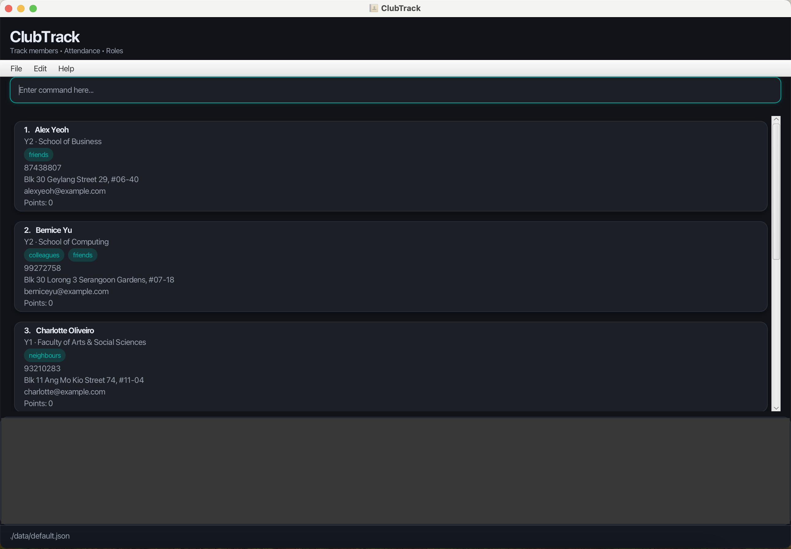

---

layout: page
title: User Guide
---

ClubTrack is a **desktop app for managing club members and attendance, optimized for use via a Command Line Interface (CLI)** while retaining the benefits of a Graphical User Interface (GUI).

## Target User Profile

ClubTrack is designed for **university student club executive committee (exco) members** who need to:

* Manage large member databases (50–200 members)
* Track attendance across multiple events and sessions
* Assign roles and responsibilities to members
* Monitor member participation through points systems

**Ideal users are:**

* Comfortable with command-line interfaces
* Need to perform member management tasks quickly
* Prefer keyboard input over mouse clicking
* Manage active clubs with regular events and meetings

## Value Proposition

ClubTrack enables club executives to **manage members, track attendance, and assign points up to 3× faster** than traditional spreadsheet-based solutions through an intuitive command-line interface optimized for power users.

---

## Quick start

1. **Check your Java version**

   ClubTrack requires **Java 17** to run.

   To check your version, open a terminal and type:

   ```bash
   java -version
   ```

   If you do not have Java 17 installed, please download it here:

    * [Windows Installation Guide](https://se-education.org/guides/tutorials/javaInstallationWindows.html)
    * [Mac Installation Guide](https://se-education.org/guides/tutorials/javaInstallationMac.html)
    * [Linux Installation Guide](https://se-education.org/guides/tutorials/javaInstallationLinux.html)

2. **Download ClubTrack**

   Download the latest `.jar` file from our [GitHub releases page](https://github.com/AY2526S1-CS2103T-W10-4/tp/releases).

3. **Choose a home folder**

   Move the `.jar` file to the folder where you would like ClubTrack to save your data.

4. **Open your terminal and navigate to that folder**

   ```bash
   cd /path/to/your/folder
   ```

5. **Run the app**

   ```bash
   java -jar ClubTrack.jar
   ```

   A GUI similar to the one below should appear in a few seconds. The app starts with sample data.
   

6. **Try your first command**

   Type a command in the command box and press Enter to execute it.
   For example, typing **`help`** will open the help window.

   Some example commands you can try:

    * `list` : Lists all members in the current list.
    * `add n/John Doe p/98123456 e/johnd@example.com a/John street y/2 f/SOC` : Adds a member named John Doe.
    * `present 1` : Marks the first member as present.
    * `switch Training_2025_10_20` : Switches to (or creates) a list for that event.
    * `clear` : Deletes all members **in the current list**.
    * `exit` : Exits the app.

7. Refer to the [Features](#features) below for details of each command.

---

## Features

<div markdown="block" class="alert alert-info">

**:information_source: Notes about the command format:**

* Words in `UPPER_CASE` are the parameters to be supplied by the user.
  e.g. in `add n/NAME`, `NAME` is a parameter which can be used as `add n/John Doe`.

* Items in square brackets are optional.
  e.g `n/NAME [t/TAG]` can be used as `n/John Doe t/Treasurer` or as `n/John Doe`.

* Items with `…` after them can be used multiple times including zero times.
  e.g. `[t/TAG]…​` can be used as ` ` (i.e. 0 times), `t/Treasurer`, `t/Treasurer t/Logistics` etc.

* Parameters can be in any order.
  e.g. if the command specifies `n/NAME p/PHONE_NUMBER`, `p/PHONE_NUMBER n/NAME` is also acceptable.

* Extraneous parameters for commands that do not take in parameters (such as `help`, `list`, `exit` and `clear`) will be ignored.
  e.g. if the command specifies `help 123`, it will be interpreted as `help`.

* **List names** used in `switch` and `remove` are plain text strings. Underscores and dashes are allowed, e.g. `Training_2025_10_20`.

</div>

---

### Viewing help : `help`

Shows a message explaining how to access the help page.

**Format:** `help`

---

### Adding a member : `add`

Adds a member to ClubTrack.

**Format:**
`add n/NAME p/PHONE e/EMAIL a/ADDRESS y/YEAR_OF_STUDY f/FACULTY [t/TAG]…`

**Phone constraint:** phone numbers must be **Singapore mobile numbers** — **exactly 8 digits, starting with 8 or 9** (e.g. `98123456`, `83123456`).

<div markdown="span" class="alert alert-primary">:bulb: **Tip:**  
A member can have any number of tags (including 0), e.g. their role or committee.
</div>

**Examples:**

* `add n/John Doe p/98123456 e/johnd@example.com a/John street y/3 f/SOC`
* `add n/Betsy Crowe p/83123456 e/betsycrowe@example.com a/Newgate Prison y/2 f/CDE  t/Treasurer t/Logistics`

---

### Listing all members : `list`

Shows a list of all members **in the current list**.

**Format:** `list`

---

### Editing a member : `edit`

Edits an existing member.

**Format:**
`edit INDEX [n/NAME] [p/PHONE] [e/EMAIL] [a/ADDRESS] [y/YEAR] [f/FACULTY] [t/TAG]…`

* Edits the member at the specified `INDEX`. The index refers to the index number shown in the displayed member list.
  The index **must be a positive integer** 1, 2, 3, …
* At least one of the optional fields must be provided.
* Existing values will be updated to the input values.
* When editing tags, the existing tags of the member will be replaced.
* You can remove all tags by typing `t/` without specifying any tags after it.

**Examples:**

* `edit 1 p/91234567 e/johndoe@example.com`
* `edit 2 n/Betsy Crower t/`

---

### Locating members by keyword : `find`

Finds members whose **non-tag fields** contain **any** of the given keywords.

**Format:**  
`find KEYWORD [MORE_KEYWORDS]`

**What it searches:**
- name
- phone
- email
- address
- faculty
- year of study

**Rules:**

- Match is **case-insensitive** (`john` matches `John`)
- Match is **substring-based** (`alex` matches `Alexander`, `alex@example.com`)
- Order of keywords **does not** matter
- A member is returned if **any** of these fields contains **any** of the keywords (logical **OR**)
- **Tags are not searched here** — use [`search`](#searching-members-by-tag-prefix--search) for tag-based filtering.

**Examples:**

- `find john`
- `find soc`
- `find 9876`
- `find Y2`

### Searching members by tag prefix : `search`

Finds members whose **tags start with** the given prefix(es).
Use this when your club has tag conventions like `exco-*`, `dance-*`, `logi-*`.

**Format:**
`search t/TAG_PREFIX…`

**Rules:**

* Match is **case-insensitive**
* Match is **prefix-based**: `t/log` matches `logi`, `logistics`, `log-2025`
* You can give **multiple** prefixes; member is returned if it matches **any** prefix (logical **OR**)
* At least **one** `t/` must be supplied

**Examples:**

* `search t/exco` → matches `exco`, `exco-head`, `exco-programme`
* `search t/dan t/perf` → matches members tagged `dance`, `dance-lead`, `performance`, `performer`
* `search t/comm` → matches `committee`, `comm-head`, `comm-logi`

---

### Marking attendance : `present`

Marks the specified member as present **in the current list**.

**Format:**
`present INDEX`

**Examples:**

* `present 1`
* `present 4`

---

### Unmarking attendance : `absent`

Unmarks the specified member, setting them as absent **in the current list**.

**Format:**
`absent INDEX`

**Examples:**

* `absent 1`
* `absent 3`

---

### Viewing attendance : `attendance`

Displays the current attendance list, showing who is present and absent **for the current list**.

**Format:**
`attendance`

---

### Switching between lists : `switch`

Switches between different member/attendance lists, such as separate event rosters.
If the specified list does **not** exist, ClubTrack **creates a new empty list** with that name.
The app starts on the default list named `default`.

**Format:**
`switch NAME_OF_LIST`

**Examples:**

* `switch Training_2025_10_20`
* `switch MatchDay-1`

After switching, **all subsequent commands** (`add`, `present`, `clear`, `list`, `delete`, `points`, etc.) apply **only to the current list**.

---

### Removing a list : `remove`

Removes an existing list from ClubTrack.

**Format:**
`remove NAME_OF_LIST`

**Example:**

* `remove Training_2025_10_20`

---

### Adding points : `addpoints`

Adds a specified number of points to a member.

**Format:**
`addpoints INDEX pts/VALUE`

* Points can represent participation, merit, or performance.
* The integer VALUE can only be a positive integer.
* In line with typical club operations, points are usually awarded in small increments (<=100), and therefore would be 
  unrealistic to have large increments in points e.g., adding 10000000 points at once.

**Examples:**

* `addpoints 2 pts/5`
* `addpoints 1 pts/10`

---

### Deleting points : `minuspoints`

Removes a specified number of points from a member.

**Format:**
`minuspoints INDEX pts/VALUE`

* Similar to the 'addpoints' command, points are usually deducted in small decrements (<=100), and would be unrealistic to have large decrements in points e.g., subtracting 100000000 points at once.
* The integer VALUE can only be a positive integer.

**Examples:**

* `minuspoints 1 pts/3`
* `minuspoints 4 pts/10`

---

### Viewing member points : `points`

Shows the **current points** of a specified member in the current list.

**Format:**
`points INDEX`

**Examples:**

* `points 1`
* `points 3`

---

### Adding tags to a member : `tag`

Adds a tag to the specified member.

**Format:**
`tag INDEX TAG`

* Only alphanumeric characters are accepted as tags, other inputs will be ignored.

**Examples:**

* `tag 1 Treasurer`
* `tag 2 Committee`

---

### Removing tags from a member : `untag`

Removes a tag from the specified member.

**Format:**
`untag INDEX TAG`

* Only alphanumeric characters are accepted to untag, other inputs will be ignored.

**Examples:**

* `untag 1 Treasurer`
* `untag 2 Committee`

---

### Deleting a member : `delete`

Deletes the specified member **from the current list**.

**Format:**
`delete INDEX`

**Examples:**

* `delete 3`
* `find John` followed by `delete 1`

---

### Clearing all entries in the current list : `clear`

Clears **all members in the current list**. Other lists are not affected.

**Format:**
`clear`

<div markdown="span" class="alert alert-warning">:exclamation: **Caution:**  
This action cannot be undone.
</div>

---

### Exiting the program : `exit`

Exits the ClubTrack application.

**Format:**
`exit`

---

### Saving the data

ClubTrack data are saved automatically after any command that changes the data.
There is no need to save manually.

---

### Editing the data files

ClubTrack stores **each list in its own JSON file** inside the `data/` folder (next to the `.jar`).

- The default list is saved as:  
  `data/default.json`
- When you run `switch Training_2025_10_20`, ClubTrack creates/uses:  
  `data/Training_2025_10_20.json`
- Every list name maps 1-to-1 to a JSON file with the **same name**.

Advanced users may edit these JSON files directly.

> **Caution:**
> - Make sure the JSON stays valid (correct braces, field names, commas).
> - If a file is edited incorrectly, ClubTrack may reset that list or refuse to load it.
> - Do **not** rename the JSON files manually unless you also use the same name in the `switch` command.

---

## FAQ

**Q:** How do I transfer my data to another computer?
**A:** Install the app on the other computer and replace the empty data file it creates with your existing ClubTrack data file.

**Q:** I entered the wrong command. Will it break my data?
**A:** No. Invalid commands are safely ignored, and an error message will appear.

**Q:** The app does not open.
**A:** Ensure you are using Java 17 or above. If issues persist, download the latest `.jar` file and try again.

**Q:** Will I have to create a completely new list from scratch for separate events?
**A:** No, excos can simply duplicate a previous event's JSON file, rename it, and load it as a new list to 
serve as a base template, eliminating the need to re-enter records manually. From there, edit the names accordingly. 

---

## Command summary

| **Action**               | **Format, Examples**                                                                                                                                       |
| ------------------------ | ---------------------------------------------------------------------------------------------------------------------------------------------------------- |
| **Add Member**           | `add n/NAME p/PHONE e/EMAIL a/ADDRESS y/YEAR f/FACULTY [t/TAG]…` e.g. `add n/John Doe p/98123456 e/john@example.com a/Blk 12 Hillview y/2 f/SOC t/Captain` |
| **Edit Member**          | `edit INDEX [n/NAME] [p/PHONE] [e/EMAIL] [y/YEAR] [f/FACULTY] [a/ADDRESS] [t/TAG]…` e.g. `edit 2 n/Betsy Crowe t/Treasurer`                                |
| **Delete Member**        | `delete INDEX` e.g. `delete 3`                                                                                                                             |
| **List Members**         | `list`                                                                                                                                                     |
| **Find Member**          | `find KEYWORD [MORE_KEYWORDS]` e.g. `find John David`                                                                                                      |
| **Search (Name & Tags)** | `search [t/TAG]… [any/]` e.g. `search t/Logistics any/`                                                                                     |
| **Mark Attendance**      | `present INDEX`                                                                                                                                            |
| **Unmark Attendance**    | `absent INDEX`                                                                                                                                             |
| **View Attendance**      | `attendance`                                                                                                                                               |
| **Switch Lists**         | `switch NAME_OF_LIST` e.g. `switch Training_2025_10_20`                                                                                                    |
| **Remove List**          | `remove NAME_OF_LIST` e.g. `remove Training_2025_10_20`                                                                                                    |
| **Add Points**           | `addpoints INDEX pts/VALUE` e.g. `addpoints 1 pts/5`                                                                                                       |
| **Minus Points**         | `minuspoints INDEX pts/VALUE` e.g. `minuspoints 2 pts/5`                                                                                                   |
| **View Points**          | `points INDEX` e.g. `points 1`                                                                                                                             |
| **Add Tag**              | `tag INDEX TAG` e.g. `tag 1 Treasurer`                                                                                                                     |
| **Remove Tag**           | `untag INDEX TAG` e.g. `untag 1 Treasurer`                                                                                                                 |
| **Clear Current List**   | `clear`                                                                                                                                                    |
| **Help**                 | `help`                                                                                                                                                     |
| **Exit**                 | `exit`                                                                                                                                                     |
