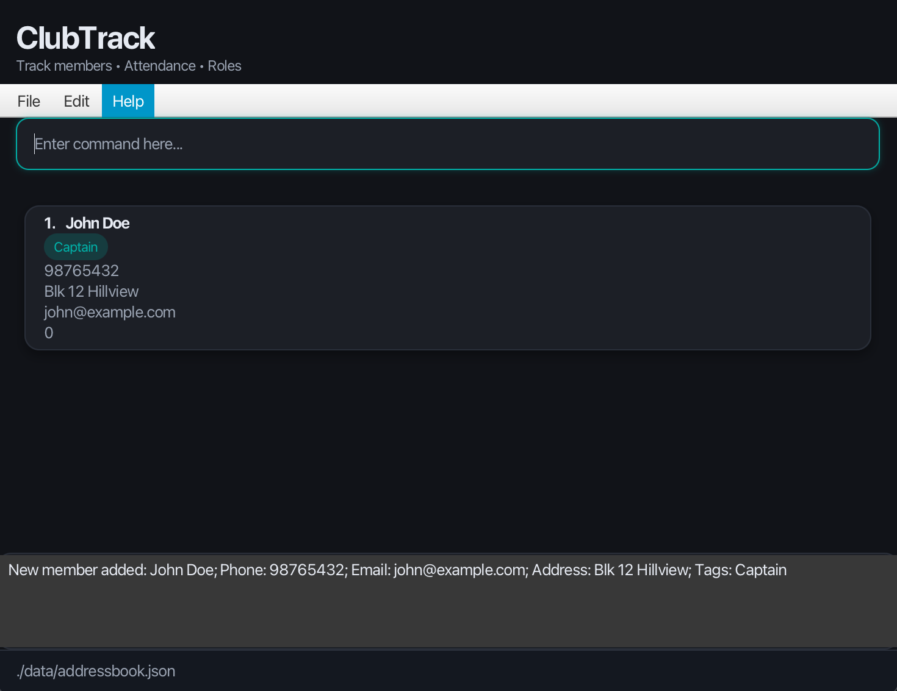

ClubTrack is a **desktop app for managing club members and attendance, optimized for use via a Command Line Interface (CLI)** while retaining the benefits of a Graphical User Interface (GUI).

## Target User Profile

ClubTrack is designed for **university student club executive committee (exco) members** who need to:
- Manage large member databases (50-200 members)
- Track attendance across multiple events and sessions
- Assign roles and responsibilities to members
- Monitor member participation through points systems

**Ideal users are:**
- Comfortable with command-line interfaces
- Need to perform member management tasks quickly
- Prefer keyboard input over mouse clicking
- Manage active clubs with regular events and meetings

## Value Proposition

ClubTrack enables club executives to **manage members, track attendance, and assign points up to 3x faster** than traditional spreadsheet-based solutions through an intuitive command-line interface optimized for power users.

* Table of Contents
  {:toc}

--------------------------------------------------------------------------------------------------------------------

## Quick start

1. **Check your Java version**

   ClubTrack requires **Java 17** to run.

   To check your version, open a terminal and type:
   ```
   java -version
   ```

   If you do not have Java 17 installed, please download it here:
    * [Windows Installation Guide](https://se-education.org/guides/tutorials/javaInstallationWindows.html)
    * [Mac Installation Guide](https://se-education.org/guides/tutorials/javaInstallationMac.html)
    * [Linux Installation Guide](https://se-education.org/guides/tutorials/javaInstallationLinux.html)

2. **Download ClubTrack**

   Download the latest `.jar` file from our [GitHub releases page](https://github.com/AY2526S1-CS2103T-W10-4/tp/releases).

3. **Choose a home folder**

   Move the `.jar` file to the folder where you would like ClubTrack to save your data.

4. **Open your terminal and navigate to that folder**

   For example:
   ```
   cd home/documents/clubtrack
   ```

5. **Run the app**

   Once you are in the correct folder, run:
   ```
   java -jar ClubTrack.jar
   ```
   A GUI similar to the one below should appear in a few seconds. Note how the app contains some sample data.  
   

6. **Try your first command**

   Type a command in the command box and press Enter to execute it.  
   For example, typing **`help`** and pressing Enter will open the help window.

   Some example commands you can try:
    * `list` : Lists all members.
    * `add n/John Doe p/98765432 e/johnd@example.com y/2 f/SOC a/John street, block 123, #01-01` : Adds a member named John Doe.
    * `present 1` : Marks the first member as present.
    * `absent 1` : Marks the first member as absent.
    * `clear` : Deletes all members.
    * `exit` : Exits the app.

7. Refer to the [Features](#features) below for details of each command.

--------------------------------------------------------------------------------------------------------------------

## Features

<div markdown="block" class="alert alert-info">

**:information_source: Notes about the command format:**<br>

* Words in `UPPER_CASE` are the parameters to be supplied by the user.<br>
  e.g. in `add n/NAME`, `NAME` is a parameter which can be used as `add n/John Doe`.

* Items in square brackets are optional.<br>
  e.g `n/NAME [t/TAG]` can be used as `n/John Doe t/Treasurer` or as `n/John Doe`.

* Items with `…`​ after them can be used multiple times including zero times.<br>
  e.g. `[t/TAG]…​` can be used as ` ` (i.e. 0 times), `t/Treasurer`, `t/Treasurer t/Logistics` etc.

* Parameters can be in any order.<br>
  e.g. if the command specifies `n/NAME p/PHONE_NUMBER`, `p/PHONE_NUMBER n/NAME` is also acceptable.

* Extraneous parameters for commands that do not take in parameters (such as `help`, `list`, `exit` and `clear`) will be ignored.<br>
  e.g. if the command specifies `help 123`, it will be interpreted as `help`.

</div>

---

### Viewing help : `help`

Shows a message explaining how to access the help page.

Format: `help`

---

### Adding a member : `add`

Adds a member to ClubTrack.

**Format:**  
`add n/NAME p/PHONE_NUMBER e/EMAIL y/YEAR_OF_STUDY f/FACULTY a/ADDRESS [t/TAG]…​`

<div markdown="span" class="alert alert-primary">:bulb: **Tip:**  
A member can have any number of tags (including 0), e.g. their role or committee.
</div>

**Examples:**
* `add n/John Doe p/98765432 e/johnd@example.com y/3 f/SOC a/John street, block 123, #01-01`
* `add n/Betsy Crowe p/98761234  e/betsycrowe@example.com y/2 f/CDE a/Newgate Prison  t/Logistics t/Treasurer`
* `add n/John Cena p/91823498  e/johncena@example.com y/1 f/FASS a/your mom's house t/teacher t/Colleague`
* `add n/tommy shelby p/89763647 e/tommyshelby@example.com y/1 f/FOS a/The Garrison`
---

### Listing all members : `list`

Shows a list of all members in ClubTrack.

Format: `list`

---

### Editing a member : `edit`

Edits an existing member.

**Format:**  
`edit INDEX [n/NAME] [p/PHONE] [e/EMAIL] [a/ADDRESS] [t/TAG]…​`

* Edits the member at the specified `INDEX`. The index refers to the index number shown in the displayed member list.  
  The index **must be a positive integer** 1, 2, 3, …​
* At least one of the optional fields must be provided.
* Existing values will be updated to the input values.
* When editing tags, the existing tags of the member will be replaced.
* You can remove all tags by typing `t/` without specifying any tags after it.

**Examples:**
* `edit 1 p/91234567 e/johndoe@example.com`
* `edit 2 n/Betsy Crower t/`

---

### Locating members by name : `find`

Finds members whose names contain any of the given keywords.

**Format:**  
`find KEYWORD [MORE_KEYWORDS]`

* The search is case-insensitive. e.g. `hans` will match `Hans`.
* The order of the keywords does not matter.
* Only full words will be matched (e.g. `Han` will not match `Hans`).
* Members matching at least one keyword will be returned (i.e. OR search).

**Examples:**
* `find John`
* `find Alex David`

---

### Searching by name and tags : `search`

Filters the displayed list by **name** and/or **tags**.

**Format:**  
`search [n/NAME_QUERY] [t/TAG]… [any/]`

* `n/NAME_QUERY` — case-insensitive token-prefix match on the member’s name.  
  (e.g., `n/char oli` matches “Charlotte Oliveira”.)
* `t/TAG` — repeatable; filters by tags.  
  Default logic is **AND** (must contain all listed tags).
* `any/` — optional flag; changes tag logic to **OR** (contains *any* of the listed tags).
* At least one of `n/` or `t/` must be supplied.

**Examples:**
* `search n/char`
* `search t/Treasurer t/Logistics`
* `search n/david t/Family`
* `search t/Dance t/Logistics any/`

---

### Marking attendance : `present`

Marks the specified member as present.

**Format:**  
`present INDEX`

* Marks the member at the specified `INDEX` in the displayed list.
* Useful for marking attendance during training or meetings.

**Examples:**
* `present 1`
* `present 4`

---

### Unmarking attendance : `absent`

Unmarks the specified member, setting them as absent.

**Format:**  
`absent INDEX`

**Examples:**
* `absent 1`
* `absent 3`

---

### Viewing attendance : `attendance`

Displays the current attendance list, showing who is present and absent.

**Format:**  
`attendance`

---

### Switching between lists : `switch`

Switches between different attendance lists, such as separate training days or event rosters.
The starting list is named `clubtrack`.

**Format:**  
`switch NAME_OF_LIST`

**Examples:**
* `switch Training_2025_10_20`
* `switch MatchDay_1`

After switching, all subsequent attendance and point operations apply to that list.

---

### Removing a list : `remove`

Removes an existing attendance list.

**Format:**  
`remove NAME_OF_LIST`

**Examples:**
* `remove Training_2025_10_20`

---

### Adding points : `addpoints`

Adds a specified number of points to a member.

**Format:**  
`addpoints INDEX pts/VALUE`

* Points can represent participation, merit, or performance.
* The integer VALUE can be positive or negative.

**Examples:**
* `addpoints 2 pts/5`
* `addpoints 1 pts/10`

---

### Deleting points : `minuspoints`

Removes a specified number of points from a member.

**Format:**  
`minuspoints INDEX pts/VALUE`

**Examples:**
* `minuspoints 1 pts/3`
* `minuspoints 4 pts/10`

---

### Adding tags to a member : `tag`

Adds a tag to the specified member.

**Format:**  
`tag INDEX TAG`

* Adds the specified `TAG` to the member at the specified `INDEX`.
* The index refers to the index number shown in the displayed member list.
* The index **must be a positive integer** 1, 2, 3, …​
* If the tag already exists, the command will still succeed (no duplicate tags).

**Examples:**
* `tag 1 Treasurer`
* `tag 2 Committee`

---

### Removing tags from a member : `untag`

Removes a tag from the specified member.

**Format:**  
`untag INDEX TAG`

* Removes the specified `TAG` from the member at the specified `INDEX`.
* If the tag doesn't exist, the command will still succeed.

**Examples:**
* `untag 1 Treasurer`
* `untag 2 Committee`

---

### Viewing member points : `points`

Shows the current points of a specified member.

**Format:**  
`points INDEX`

* Shows the points of the member at the specified `INDEX`.

**Examples:**
* `points 1`
* `points 3`

---

### Deleting a member : `delete`

Deletes the specified member.

**Format:**  
`delete INDEX`

**Examples:**
* `delete 3`
* `find John` followed by `delete 1`

---

### Clearing all entries : `clear`

Clears all entries from ClubTrack.

**Format:**  
`clear`

<div markdown="span" class="alert alert-warning">:exclamation: **Caution:**  
This action cannot be undone.
</div>

---

### Exiting the program : `exit`

Exits the ClubTrack application.

**Format:**  
`exit`

---

### Saving the data

ClubTrack data are saved automatically after any command that changes the data.  
There is no need to save manually.

---

### Editing the data file

ClubTrack data are stored automatically as a JSON file at:  
`[JAR file location]/data/clubtrack.json`

Advanced users may edit this file directly.

<div markdown="span" class="alert alert-warning">:exclamation: **Caution:**  
If you modify the file incorrectly, ClubTrack will discard all data and start fresh at the next run.  
Always back up your data before manual edits.
</div>

--------------------------------------------------------------------------------------------------------------------

## FAQ

**Q:** How do I transfer my data to another computer?  
**A:** Install the app on the other computer and replace the empty data file it creates with your existing ClubTrack data file.

**Q:** I entered the wrong command. Will it break my data?  
**A:** No. Invalid commands are safely ignored, and an error message will appear.

**Q:** The app does not open.  
**A:** Ensure you are using Java 17 or above. If issues persist, download the latest `.jar` file and try again.

--------------------------------------------------------------------------------------------------------------------

## Command summary

| **Action** | **Format, Examples** |
|-------------|----------------------|
| **Add Member** | `add n/NAME p/PHONE e/EMAIL y/YEAR f/FACULTY a/ADDRESS [t/TAG]…`<br> e.g., `add n/John Doe p/98765432 e/john@example.com y/2 f/SOC a/Blk 12 Hillview t/Captain` |
| **Edit Member** | `edit INDEX [n/NAME] [p/PHONE] [e/EMAIL] [y/YEAR] [f/FACULTY] [a/ADDRESS] [t/TAG]…`<br> e.g., `edit 2 n/Betsy Crowe t/Treasurer` |
| **Delete Member** | `delete INDEX`<br> e.g., `delete 3` |
| **List Members** | `list` |
| **Find Member** | `find KEYWORD [MORE_KEYWORDS]`<br> e.g., `find John David` |
| **Search (Name & Tags)** | `search [n/NAME_QUERY] [t/TAG]… [any/]`<br> e.g., `search t/Logistics any/` |
| **Mark Attendance** | `present INDEX`<br> e.g., `present 1` |
| **Unmark Attendance** | `absent INDEX`<br> e.g., `absent 2` |
| **View Attendance** | `attendance` |
| **Switch Lists** | `switch n/NAME_OF_LIST`<br> e.g., `switch n/Training_2025_10_20` |
| **Remove List** | `remove n/NAME_OF_LIST`<br> e.g., `remove n/Training_2025_10_20` |
| **Add Points** | `addpoints INDEX pts/VALUE`<br> e.g., `addpoints 1 pts/5` |
| **Delete Points** | `minuspoints INDEX pts/VALUE`<br> e.g., `minuspoints 2 pts/5` |
| **Add Tag** | `tag INDEX TAG`<br> e.g., `tag 1 Treasurer` |
| **Remove Tag** | `untag INDEX TAG`<br> e.g., `untag 1 Treasurer` |
| **View Points** | `points INDEX`<br> e.g., `points 1` |
| **Clear All** | `clear` |
| **Help** | `help` |
| **Exit** | `exit` |

--------------------------------------------------------------------------------------------------------------------
