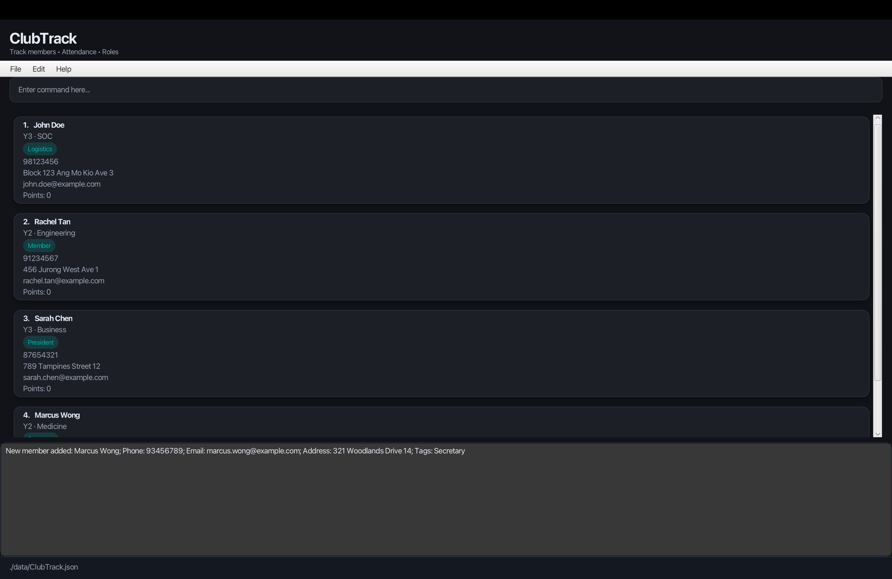

**ClubTrack is a desktop application for managing club members and attendance, optimized for university student club executive committee (exco) members.** While it has a GUI, most of the user interactions happen using a CLI (Command Line Interface).

## Key Features

* **Member Management**: Add, edit, and organize member information including contact details, year of study, and faculty
* **Multi-Event Lists**: Switch between different event rosters and attendance lists seamlessly
* **Attendance Tracking**: Mark members as present or absent for different events and meetings
* **Points System**: Award and deduct participation points to track member engagement
* **Tag-Based Organization**: Organize members by roles (e.g., committee positions) and search by tag prefixes
* **Fast CLI Operations**: Perform all operations quickly through intuitive command-line interface

## Target Users

ClubTrack is designed for **university student club executive committee (exco) members** who:
- Manage large member databases (50-500 members)
- Track attendance across multiple events and sessions
- Assign roles and responsibilities to members
- Monitor member participation through points systems
- Prefer keyboard input over mouse clicking for faster operations

## Quick Start

* If you are interested in using ClubTrack, head over to the [_Quick Start_ section of the **User Guide**](UserGuide.md#quick-start).
* If you are interested in developing ClubTrack, the [**Developer Guide**](DeveloperGuide.md) is a good place to start.

## Useful Links

* [User Guide](UserGuide.md)
* [Developer Guide](DeveloperGuide.md)
* [About Us](AboutUs.md)
* [GitHub Repository](https://github.com/AY2526S1-CS2103T-W10-4/tp)
* [Latest Releases](https://github.com/AY2526S1-CS2103T-W10-4/tp/releases)

**Acknowledgements**

* This project is based on the AddressBook-Level3 project created by the [SE-EDU initiative](https://se-education.org).
* Libraries used: [JavaFX](https://openjfx.io/), [Jackson](https://github.com/FasterXML/jackson), [JUnit5](https://github.com/junit-team/junit5)
